# Reverse-engineering an Android App’s Native C/C++ Library to Crack its Password Check (HeroCTF v7: Freeda Native Hook)

***From "WTH is Frida/Freeda?!", to JADX, to disassembling machine code with Ghidra (an NSA tool!)***

**GitHub**: [https://github.com/a-tan-cyber](https://github.com/a-tan-cyber)
**Contact**: a.tan.cyber@protonmail.com

**CTF:** HeroCTF v7 – Freeda Native Hook  
**Difficulty:** hard  
**Tags:** android, cpp, frida, java, reversing  

> **Challenge text (from HeroCTF):**  
> Try to find the password to open this vault!  
> I was told that it was dangerous to let my application install on a rooted machine. I fixed the problem!  
> I was also told that it was safer to move sensitive functions from my code to a native library, so that's what I did!  
> Don't waste too much time statically analyzing the application; there are much faster ways.  
>  
> Format: `^Hero{\S+}$` – Author: Thib

---

## 0. What the challenge looked like

We get an Android APK (`app-ctf.apk`) that looks like a tiny "vault" app when you run it on an emulator:

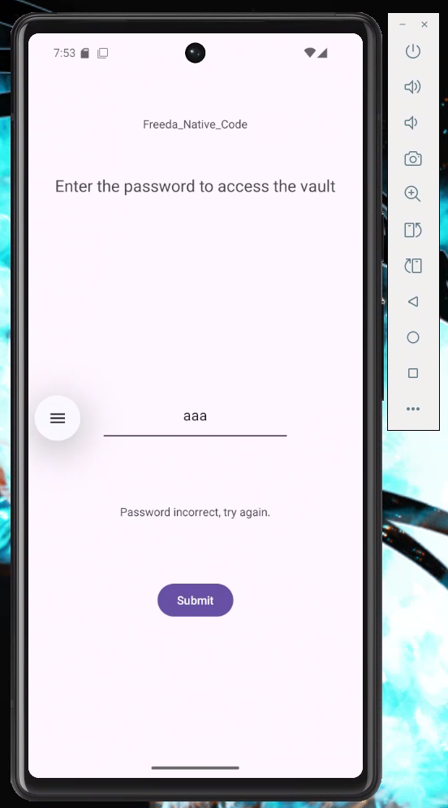

- One text field (password / flag input)
- One **Submit** button
- A status line under it

Behaviour:

- Empty input → `"Password can't be blank!"`
- Wrong input → `"Password incorrect, try again."`
- Correct input → ?

The challenge text hints that:

- The important logic was moved into a **native library**, and
- The author *claims* they "fixed" the issue of running on rooted devices
- Flag format: `Hero{...}`

Initial thoughts:

- ✅ Android
- ✅ Native (.so) library
- ✅ Root detection
- ✅ Flag is probably computed in C/C++ and not visible in plain Java.

Hypothesis:

> Somewhere in a .so file, some C/C++ code generates the flag and compares my
> 
> 
> input against it. If the device is detected as rooted, it probably hides the real flag.
> 

Goal: figure out what that function expects, and get the password / flag.

---

## 1. Setting up Android + Frida

I did everything from:

- PowerShell/Windows 11 host
- Android Studio emulator (x86_64 system image)
- `frida-server` running inside the emulator

Here are the commands I used to get the APK onto the emulator and Frida hooked up:

```bash
# list devices/emulators and note the serial (e.g. emulator-5554)
adb devices

# list packages containing "hero" to confirm the app's package name
adb shell pm list packages | findstr hero
# package: com.heroctf.freeda3

# install the APK on the emulator
adb install "C:\\path\\to\\app-ctf.apk"

# check the CPU ABI (e.g. x86_64) for choosing the right frida-server build
adb -s emulator-XXXX shell getprop ro.product.cpu.abi

# restart adbd as root on the emulator (if supported)
adb -s emulator-XXXX root

# push the matching frida-server binary to /data/local/tmp
adb -s emulator-XXXX push "C:\\path\\to\\frida-server-17.5.1-android-x86_64" /data/local/tmp/frida-server

# make frida-server executable
adb -s emulator-XXXX shell chmod 755 /data/local/tmp/frida-server

# start frida-server in the background on the device
adb -s emulator-XXXX shell /data/local/tmp/frida-server &

# forward host port 27042 to device port 27042 (Frida’s default)
adb -s emulator-XXXX forward tcp:27042 tcp:27042

# sanity-check that Frida can see the device and its processes
frida-ps -H 127.0.0.1:27042

# finally, attach Frida to the app and load my script (spawns the app)
frida -H 127.0.0.1:27042 -f com.heroctf.freeda3 -l "C:\\path\\to\\freeda_hook.js"

# (alternatively, if the app is already running instead of being spawned)
# frida -U -n com.heroctf.freeda3 -l "C:\\path\\to\\freeda_hook.js"

```

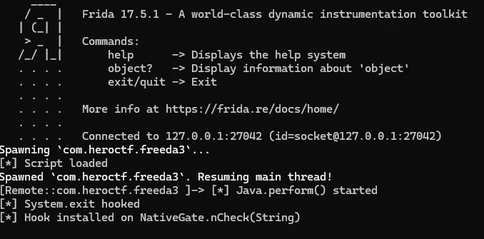

---

### What is Frida?

Frida is a **dynamic instrumentation toolkit**. You attach to a running app and you can:

- Hook Java or native functions,
- Print their arguments and return values,
- Even change behavior at runtime.

In this challenge, I used Frida to:

- Discover which classes / methods were involved in the flag check.
- Try some lazy bypasses (that didn’t actually give the flag).

---

## 2. Poking at the app - Java side - using JADX + Frida

At first my Frida script was tiny: it just enumerated loaded Java classes and printed

anything under `com.heroctf`.

```jsx
// freeda_hook.js - v1: enumerate classes under com.heroctf.*

Java.perform(function () {
    console.log("[*] Enumerating loaded Java classes under com.heroctf...");

    Java.enumerateLoadedClasses({
        onMatch: function (name) {
            if (name.indexOf("com.heroctf") === 0) {
                console.log("  " + name);
            }
        },
        onComplete: function () {
            console.log("[*] Done enumerating com.heroctf.* classes");
        }
    });
});
```

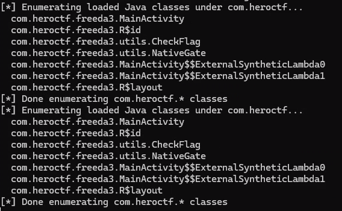

The interesting ones were:

- `com.heroctf.freeda3.MainActivity`
- `com.heroctf.freeda3.utils.CheckFlag`
- `com.heroctf.freeda3.utils.NativeGate`

The names already sounded promising: *CheckFlag* and *NativeGate*.

Once I knew which classes to look at, I opened the APK in **JADX** to see the Java code..

---

### What is JADX?

JADX is an **Android decompiler**. Feed it an APK or `.dex` file and it gives you a browsable tree of Java‑like code.

It’s great for:

- Seeing which activity is launched first,
- Following button click handlers,
- Spotting calls into native code like `System.loadLibrary("v3")`.

---

I followed the classic CTF click‑path:

1. Search for `MainActivity` to find the screen logic.
2. Inside the button click handler, I saw this line:
    
    ```java
    // MainActivity
    if (CheckFlag.checkFlag(inputFlag)) {
        passwordStatus.setText("Good ! You can use this password as the flag.");
    }
    
    ```
    
3. I Ctrl+clicked `CheckFlag` to jump into that class:
4. 
    
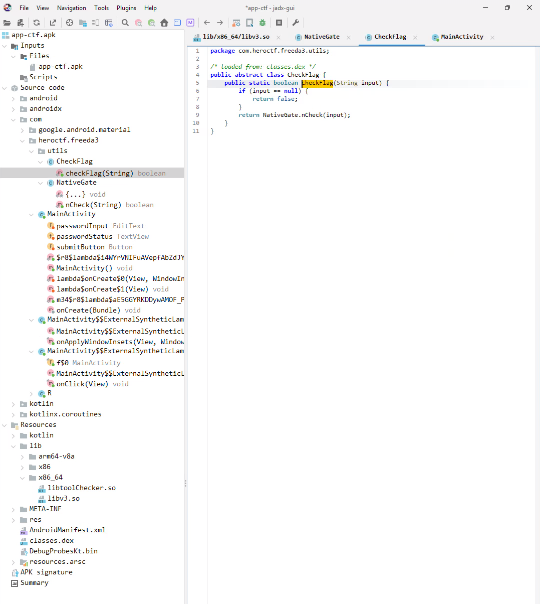
    
    ```java
    // CheckFlag
    public static boolean checkFlag(String input) {
        if (input == null) return false;
        return NativeGate.nCheck(input);
    }
    
    ```
    
    So all it does is forward the string to `NativeGate.nCheck`.
    
5. One more hop into `NativeGate`:
    
    ```java
    // NativeGate
    public abstract class NativeGate {
        public static native boolean nCheck(String str);
        static { System.loadLibrary("v3"); }
    }
    
    ```
    

That last `static { System.loadLibrary("v3"); }` line was the first big clue.

It means that at runtime, the app loads a **native library** named `libv3.so` and the actual implementation of `nCheck` lives there.

My working hypothesis became:

> The Java part is just a thin UI wrapper. The real password check (and maybe the flag generation) is in `libv3.so`, inside the function exported as `nCheck`.
> 

---

## 3. Dead end #1 – Just bypassing the checks with Frida

Before opening any native code, I tried to be lazy: *what if I just force the app to
accept any password?*

With Frida, I hooked `NativeGate.nCheck(String)` and made it always return `true`:

```jsx
// freeda_hook.js - v2: force NativeGate.nCheck(String) to always return true

Java.perform(function () {
    console.log("[*] Java.perform() started");

    var NativeGate = Java.use("com.heroctf.freeda3.utils.NativeGate");

    // nCheck is a static native method taking a java.lang.String
    NativeGate.nCheck.overload("java.lang.String").implementation = function (s) {
        console.log("[*] NativeGate.nCheck called with:", s);
        // bypass the real native check
        return true;
    };

    console.log("[*] Hooked NativeGate.nCheck(String) to always return true");
});

```

Now, when I typed something random like `aaaaaa` into the app and hit **Submit**, I got:

> Good ! You can use this password as the flag.
> 

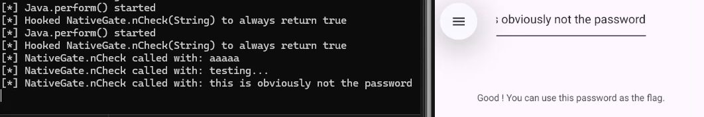

Victory? Not really.

My input clearly wasn’t in the expected `Hero{...}` format, and I hadn’t actually learned what the *real* flag was.

At that point I also tried a “read-only” hook, just to observe what the app was doing
without forcing a success. This version of the script simply logs each call to
`NativeGate.nCheck` and its return value:

```jsx
Java.perform(function () {
    console.log("[*] Java.perform() started");

    var NativeGate = Java.use("com.heroctf.freeda3.utils.NativeGate");

    // Hook the static native method nCheck(String)
    NativeGate.nCheck.overload("java.lang.String").implementation = function (s) {
        console.log("[*] NativeGate.nCheck called with:", s);

        // call the original native implementation
        var result = this.nCheck(s);

        console.log("[*] NativeGate.nCheck returned:", result);
        return result; // do not modify behavior
    };

    console.log("[*] Hook installed on NativeGate.nCheck(String) (logging only)");
});

```

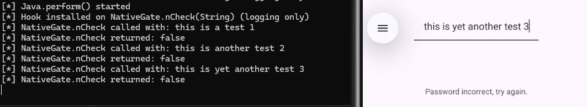

**Hypothesis:** maybe the flag string itself is somewhere in memory and I could fish it out.

This leads straight into my second dead end.

---

## 4. Dead end #2 – Hunting for `Hero{` in memory

I wrote another Frida snippet to scan the app’s memory for the string `"Hero{"`.

The idea:

> If libv3.so builds the entire flag as a normal ASCII string, maybe I can just search all readable regions for that prefix.
> 

So I:

- Enumerated all readable memory ranges,
- Called `Memory.scan` on each for the pattern `Hero{`,
- Logged any hits.

```jsx
// freeda_hook.js - v3: block System.exit and scan memory for "Hero{"

'use strict';

console.log("[*] Script loaded");

// 1) Block System.exit(int) so the app can't easily kill itself
Java.perform(function () {
    try {
        var System = Java.use("java.lang.System");

        System.exit.overload('int').implementation = function (code) {
            console.log("[*] System.exit(" + code + ") blocked");
            // Do nothing instead of exiting
        };

        console.log("[*] System.exit hooked");
    } catch (e) {
        console.log("[!] Failed to hook System.exit: " + e);
    }
});

// 2) Scan process memory for the bytes of "Hero{"
function scanForFlag() {
    console.log("[*] Starting memory scan for 'Hero{' ...");

    // Enumerate readable ranges (Frida 17-style)
    var ranges = Process.enumerateRanges({
        protection: 'r--',   // readable (usually .rodata, etc.)
        coalesce: true
    });

    console.log("[*] Got " + ranges.length + " ranges to scan");

    // Hex for "Hero{" = 48 65 72 6f 7b
    var pattern = "48 65 72 6f 7b";

    for (const range of ranges) {
        try {
            Memory.scan(range.base, range.size, pattern, {
                onMatch(address, size) {
                    try {
                        // Try to read a C string starting at the match address
                        const s = address.readCString();

                        console.log("[+] Found candidate at " + address +
                                    " in range " + range.base + " - " +
                                    range.base.add(range.size));
                        console.log("    String: " + s);
                        console.log(">>> POSSIBLE FLAG ABOVE <<<");

                        // If you want to stop after the first hit, you could:
                        // return 'stop';
                    } catch (e) {
                        // ignore bad strings that can't be read cleanly
                    }
                },
                onError(reason) {
                    // ignore scan errors for this specific range
                    // console.log("[-] Scan error in range " + range.base + ": " + reason);
                },
                onComplete() {
                    // called after finishing this range
                }
            });
        } catch (e) {
            // ignore ranges we can't scan
        }
    }

    console.log("[*] Memory scan complete.");
}

// Wait a moment so libraries are loaded, then scan
setTimeout(scanForFlag, 2000);

```

Result:

- The scan completed, but..

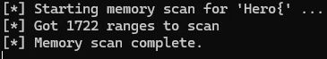

- returned nothing.

By this point, I’d spent a lot of time wrestling with runtime tricks and hadn’t gotten closer to the actual flag.

**New plan:** stop guessing at runtime. Open `libv3.so` in a real reverse‑engineering tool and see how the flag is computed.

---

## 5. Opening `libv3.so` in Ghidra

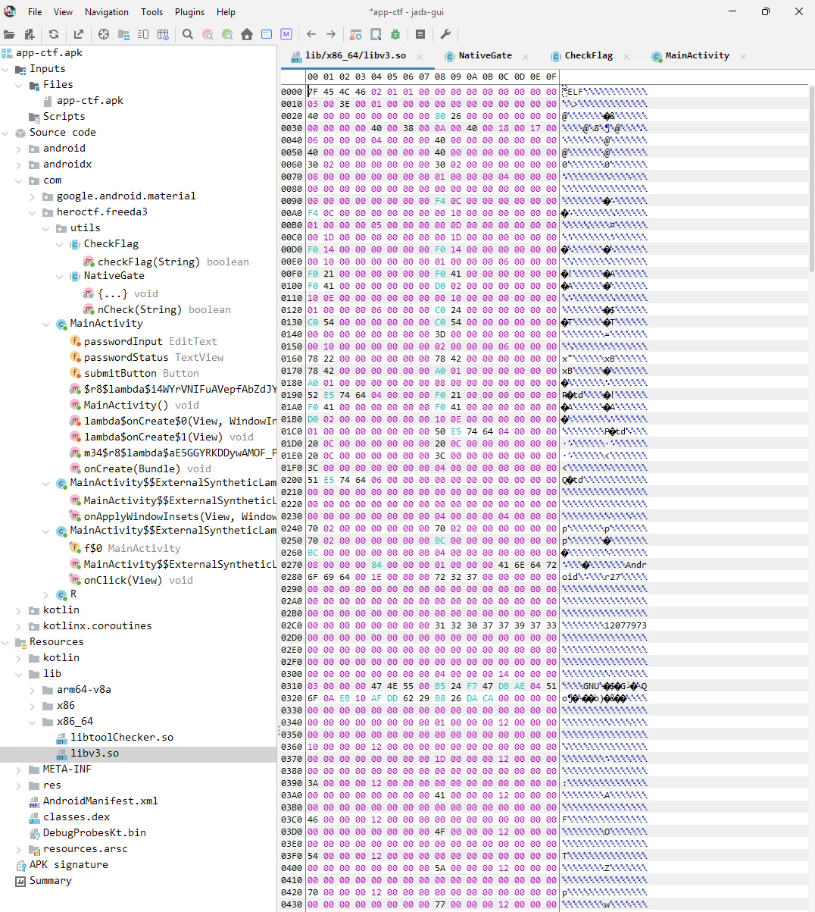

From the APK (inside the `lib/` directory), I grabbed the x86_64 version of `libv3.so` and opened it in **Ghidra**.

---

### What is Ghidra?

Ghidra is a **reverse‑engineering suite** (from the NSA, now open-source) that works great on native binaries like `.so`files. It can:

- Disassemble machine code,
- Decompile it into C‑like pseudo‑code,
- Help you explore functions, data structures, and string references.

---

In the function list, the following symbols stood out immediately:

- `Java_com_heroctf_freeda3_utils_NativeGate_nCheck`
- `get_flag`
- `check_root`
- `FUN_00102870`

I started with the obvious one: `nCheck`.

### 5.1. What `nCheck` actually does

Ghidra’s decompiler (simplified) showed:

```c
bool Java_com_heroctf_freeda3_utils_NativeGate_nCheck(JNIEnv *env, jclass clazz, jstring jstr) {
    if (jstr == NULL) return false;

    char *flag = get_flag();
    int len = (*env)->GetStringUTFLength(env, jstr);
    if (len == 0x30) { // 48 bytes
        char *input = (*env)->GetStringUTFChars(env, jstr, 0);
        int cmp = memcmp(input, flag, 0x30);
        (*env)->ReleaseStringUTFChars(env, jstr, input);
        return cmp == 0;
    }
    return false;
}

```

This was a **huge finding**:

- The correct password is simply whatever `get_flag()` returns.
- `nCheck` compares exactly `0x30` bytes (48 bytes) against that value – effectively, 47 printable characters plus a terminating `\0` byte.

So the whole challenge reduced to: *what does **`get_flag()`** return on a non‑rooted setup?**

### 5.2. What `get_flag` and `check_root` do

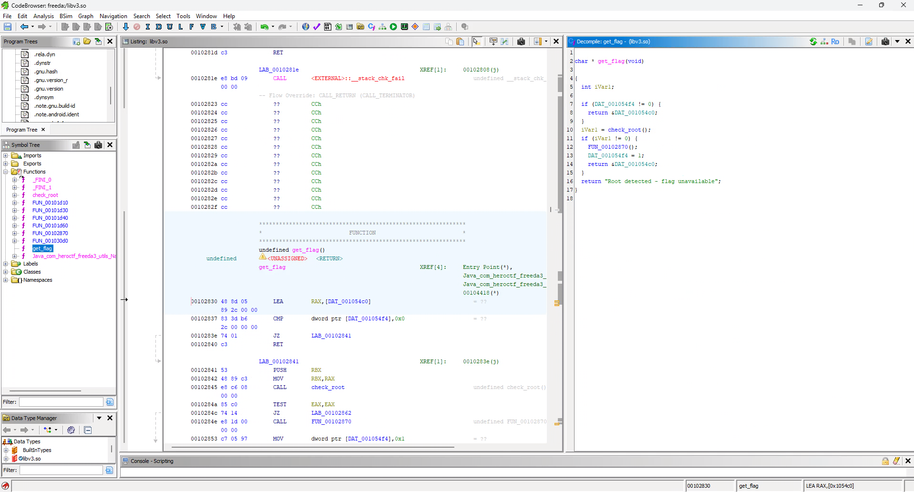

`get_flag()` decompiled to:

```c
char * get_flag(void) {
  if (DAT_001054f4 != 0) {
    return &DAT_001054c0; // already built
  }
  int r = check_root();
  if (r != 0) {
    FUN_00102870();       // builds flag into DAT_001054c0
    DAT_001054f4 = 1;
    return &DAT_001054c0;
  }
  return "Root detected - flag unavailable";
}

```

Now the challenge’s comment about *rooted devices* made more sense when looking at this logic:

– When `check_root()` returns a **non-zero** value, `get_flag()` calls `FUN_00102870()`, which writes the real flag into `DAT_001054c0` and marks it as “already built”.

– When `check_root()` returns **0**, `get_flag()` skips `FUN_00102870()` entirely and just returns the string `"Root detected - flag unavailable"`.

In other words, if the environment is considered “clean” by `check_root()`, the native code builds and returns the real flag; otherwise it falls back to that decoy string.

So `FUN_00102870()` is the function that actually **constructs the real flag in
memory**.

At this point I considered two options:

1. Use Frida again, hook `check_root()` to return a non‑zero value at runtime, then
    
    call `get_flag()` and read its result.
    
2. Stay in Ghidra and reverse `FUN_00102870()`, then re‑implement it in Python and let the script spit out the flag.

Option 1 sounded fun but meant more native hooking; option 2 was just some coding of low-level bit manipulation logic.

I chose option 2.

---

## 6. Understanding `FUN_00102870` (the flag builder)

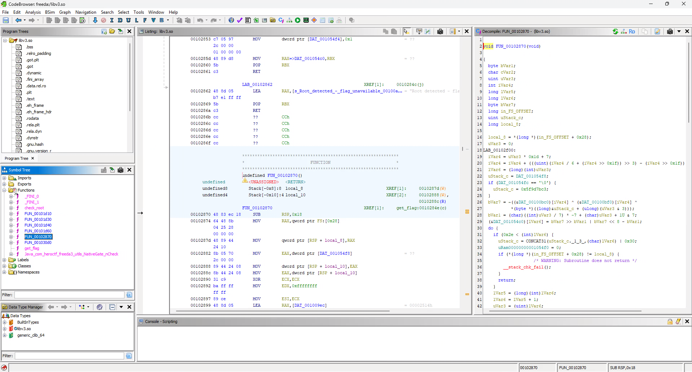

`FUN_00102870` looked scary at first: a long function, variables with weird names, odd loops. But after reading it a few times, a pattern emerged:

- There’s a loop over an index `i` from `0` to `0x2e` (47 bytes).
- On each iteration it writes one byte to `DAT_001054c0[i]` (the flag buffer).
- It uses two lookup tables at `DAT_00100bc0` and `DAT_00100bf0`.
- It mixes in a 4‑byte key `0x5f9d7bc3`.
- Operations are mostly XOR, NOT, and **bit rotations**.

In high‑level terms, for each `i` it does something like:

1. Compute an index `idx` into those two tables.
2. Read `bc0[idx]` and `bf0[idx]`.
3. XOR them with one byte of the key (`key[i & 3]`).
4. Bitwise NOT the result.
5. Rotate that byte by some `i`‑dependent amount.
6. Store the result into the flag buffer at position `i`.

Instead of trying to mathematically "undo" this obfuscation, I decided to copy it verbatim into a Python script and let the computer do the work.

---

## 7. Re‑implementing `FUN_00102870` in Python

From Ghidra I learned:

- The image base for `libv3.so` is `0x00100000`.
- First table is at `DAT_00100bc0`.
- Second table is at `DAT_00100bf0`.

So in Python I:

1. Opened `libv3.so` as a binary file.
2. Sought to `ADDR - IMAGE_BASE` to grab each table.
3. Ran a loop for `i = 0 .. 0x2e` copying the arithmetic from `FUN_00102870`.
4. Collected the resulting bytes and decoded them as ASCII.

The core of the script looks like this:

```python
#!/usr/bin/env python3
import struct

IMAGE_BASE = 0x00100000  # from Ghidra (File -> Properties)
ADDR_BC0   = 0x00100bc0  # DAT_00100bc0
ADDR_BF0   = 0x00100bf0  # DAT_00100bf0
FLAG_LEN   = 0x2f        # i = 0..0x2e (47 bytes)

def vaddr_to_offset(vaddr):
    return vaddr - IMAGE_BASE

with open("libv3.so", "rb") as f:
    f.seek(vaddr_to_offset(ADDR_BC0))
    table_bc0 = f.read(0x1000)
    f.seek(vaddr_to_offset(ADDR_BF0))
    table_bf0 = f.read(0x1000)

uStack_c = 0x5f9d7bc3
key_bytes = struct.pack("<I", uStack_c)

flag_bytes = []

for i in range(FLAG_LEN):
    iVar4 = i * 0x1d + 7
    t = (iVar4 // 6) >> 3
    idx = iVar4 + t * -0x30

    b_bc0 = table_bc0[idx]
    b_bf0 = table_bf0[idx]
    b_key = key_bytes[i & 3]

    b = ~(b_bc0 ^ b_bf0 ^ b_key) & 0xff
    rot = (((i // 7) * -7) + i + 1) & 7
    flag_byte = ((b >> rot) | ((b << (8 - rot)) & 0xff)) & 0xff
    flag_bytes.append(flag_byte)

flag = bytes(flag_bytes)
print(flag)
print(flag.decode('ascii'))

```

When I ran this on `libv3.so`, it printed:

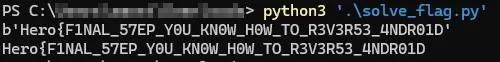

Which looks exactly like a HeroCTF flag 🎉

---

## 8. Takeaways

A few things I learned along the way:

- **Bypassing != solving.** Making `nCheck()` always return `true` felt clever for a minute, but it didn’t teach me how the flag was generated.
- **Follow the trail: UI → Java → native.** JADX made it clear: the button handler calls `CheckFlag.checkFlag`, which forwards to `NativeGate.nCheck`, which lives in `libv3.so`.
- **Native libraries hide the fun stuff.** In Android, the interesting secrets are often buried in `.so` files, not in the Java code.
- **Static analysis can beat tool‑fighting.** Once I opened `libv3.so` in Ghidra, understanding `nCheck`/`get_flag`/`FUN_00102870` was more straightforward than, trying to dynamically glitch them with hooks.
- **You don’t always need to “undo” the math.** Simply copying the obfuscated, logic into Python and running it was enough to recover the flag.

### Final flag

```
Hero{F1NAL_57EP_Y0U_KN0W_H0W_TO_R3V3R53_4NDR01D}

```

— End of writeup —
